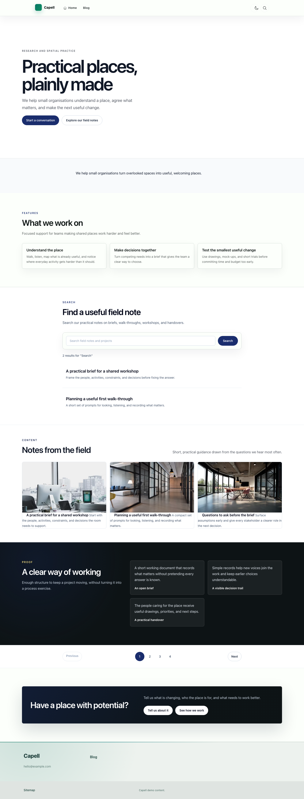

# Foundation Theme

<!-- prettier-ignore-start -->

## What This Plugin Adds

Foundation Theme is an **Available**, **No schema impact** Capell theme in the **Capell Themes** product group. It ships as `capell-app/theme-foundation` and extends these surfaces: admin, frontend.

Theme Foundation provides the shared public layouts, runtime design tokens, layout defaults, and override contracts used by Capell themes. It renders host-owned page data and does not introduce a separate content model.

Sites can use Foundation directly or extend it with a child theme, while public pages share predictable layout and token rendering without frontend authoring state.

Evidence: [`src/Providers/FoundationThemeServiceProvider.php`](src/Providers/FoundationThemeServiceProvider.php), [`src/Settings/FoundationThemeSettings.php`](src/Settings/FoundationThemeSettings.php), [`resources/views/app.blade.php`](resources/views/app.blade.php), [`resources/views/components/app/head/tokens.blade.php`](resources/views/components/app/head/tokens.blade.php), [`src/Support/Providers/RegistersLayoutNativeThemeDefaults.php`](src/Support/Providers/RegistersLayoutNativeThemeDefaults.php), [`tests/Feature/FleetPublicOutputSafetyTest.php`](tests/Feature/FleetPublicOutputSafetyTest.php), [`tests/Unit/ThemeRuntimeSettingsBindingTest.php`](tests/Unit/ThemeRuntimeSettingsBindingTest.php).

Status details:

- Status: Available
- Tier: free
- Bundle: themes
- Composer package: `capell-app/theme-foundation`
- Namespace: `Capell\FoundationTheme`
- Theme key: `default`

## Why It Matters

**For developers:** The package centralizes theme registration, token resolution, layout defaults, and public-output safety contracts for the theme fleet.

**For teams:** Teams get a consistent baseline for site chrome, layout behavior, and design settings across Capell themes.

Evidence: [`src/Providers/FoundationThemeServiceProvider.php`](src/Providers/FoundationThemeServiceProvider.php), [`src/Actions/ResolveFoundationThemeTokensAction.php`](src/Actions/ResolveFoundationThemeTokensAction.php), [`src/Actions/InstallFoundationThemeLayoutDefaultsAction.php`](src/Actions/InstallFoundationThemeLayoutDefaultsAction.php), [`src/Testing/AssertsPublicThemeOutputSafety.php`](src/Testing/AssertsPublicThemeOutputSafety.php), [`src/Settings/FoundationThemeSettings.php`](src/Settings/FoundationThemeSettings.php), [`resources/views/app.blade.php`](resources/views/app.blade.php), [`tests/Unit/FoundationThemeBoundaryTest.php`](tests/Unit/FoundationThemeBoundaryTest.php).

## Screens And Workflow

Screenshot contract: `docs/screenshots.json`.

Desktop, tablet, and mobile variants remain defined in the screenshot contract; this list groups them by workflow.

- Foundation Homepage (frontend, required).
- Foundation Directory (frontend, required).
- Foundation Detail Article (frontend, required).
- Foundation Contact (frontend, required).
- Foundation Empty State (frontend, required).
- Foundation Page Not Found (frontend, required).
- Foundation Call To Action (frontend, required).

## Technical Shape

- Service providers: `Capell\FoundationTheme\Providers\FoundationThemeServiceProvider`, `FoundationThemeSiteSpecServiceProvider`.
- Config files: `packages/theme-foundation/config/capell-theme-foundation.php`.
- Settings migrations: `packages/theme-foundation/database/settings/2026_05_10_190850_01_create_theme_foundation_settings.php`, `packages/theme-foundation/database/settings/2026_05_23_160819_add_theme_foundation_design_tokens.php`, `packages/theme-foundation/database/settings/2026_05_23_161002_refresh_theme_foundation_design_token_defaults.php`, `packages/theme-foundation/database/settings/2026_05_23_170001_add_theme_foundation_composition_tokens.php`, `packages/theme-foundation/database/settings/2026_05_23_171201_quiet_theme_foundation_composition_palette.php`, `packages/theme-foundation/database/settings/2026_05_23_180101_add_theme_foundation_image_tokens.php`, `packages/theme-foundation/database/settings/2026_06_07_000001_add_theme_foundation_dark_design_tokens.php`, `packages/theme-foundation/database/settings/2026_06_07_000002_add_theme_foundation_typography_tokens.php`, `packages/theme-foundation/database/settings/2026_07_05_000001_add_theme_foundation_motion_tokens.php`.
- Settings classes: `FoundationThemeSettings`, `FoundationThemeSettingsMigrationProvider`.
- Filament classes: `FoundationLayoutContainerSchemaExtender`, `FoundationThemeSettingsSchema`.
- Layout container projector: `FoundationLayoutContainerThemePresentationProjector` returns `FoundationLayoutContainerPresentationData` for the active `default` namespace.
- Livewire components: `AbstractAssets`, `PageAssets`, `AbstractWidget`, `Pages`.
- Extension contracts: `InstallsThemeDemo`, `OptionalExtensionAvailability`, `ProvidesThemeDemoContent`.
- Listeners: `RunTailwindAssetsOnPackageChange`.
- Actions: `BuildAssetBannerItemsAction`, `BuildBannerImageRenderDataAction`, `BuildHeroRailItemsRenderDataAction`, `BuildLayoutNeighborLinksDataAction`, `BuildPageContentRenderDataAction`, `BuildThemeDemoFormSectionAction`, `BuildThemeDemoFormsPayloadAction`, `BuildWidgetAssetRenderDataAction`, `GenerateThemeScaffoldAction`, `HasThemeIntegrationEvidenceAction`, `InstallFoundationThemeDemoAction`, `InstallFoundationThemeLayoutDefaultsAction`, `and 10 more`.
- Data objects: `AssetBannerItemData`, `BannerImageRenderData`, `FoundationLayoutContainerPresentationData`, `FoundationThemeTokensData`, `LayoutNeighborLinksData`, `NewsletterFormData`, `PageContentRenderData`, `ThemeDemoInstallData`, `ThemeFormEmbedData`, `ThemeScaffoldRequestData`, `ThemeValidationResultData`, `WidgetAssetRenderData`.
- Command signatures: `capell:theme-foundation-demo`, `capell:theme-foundation-setup`.
- Manifest action API: `demo: Capell\FoundationTheme\Actions\InstallFoundationThemeDemoAction`, `setup: Capell\FoundationTheme\Actions\SetupFoundationThemePackageAction`.
- Console command classes: `DemoCommand`, `GenerateTailwindAssetsCommand`, `MakeThemeCommand`, `SetupCommand`, `ThemeCatalogueReportCommand`, `ValidateThemesCommand`.
- Health checks: `Capell\FoundationTheme\Health\FoundationThemeHealthCheck`.
- Blade views: `packages/theme-foundation/resources/views/app.blade.php`, `packages/theme-foundation/resources/views/block/wrapper.blade.php`, `packages/theme-foundation/resources/views/components/actions/index.blade.php`, `packages/theme-foundation/resources/views/components/app/body.blade.php`, `packages/theme-foundation/resources/views/components/app/head/custom.blade.php`, `packages/theme-foundation/resources/views/components/app/head/tokens.blade.php`, `packages/theme-foundation/resources/views/components/badge.blade.php`, `packages/theme-foundation/resources/views/components/block/wrapper.blade.php`, `packages/theme-foundation/resources/views/components/button/index.blade.php`, `packages/theme-foundation/resources/views/components/content.blade.php`, `packages/theme-foundation/resources/views/components/demo/contact-page.blade.php`, `packages/theme-foundation/resources/views/components/display/art-directed-picture.blade.php`, `and 116 more`.
- Cache tags: `theme-foundation`.

## Child Theme Override Contract

Foundation Theme owns the stable child theme override surface for Capell themes. Child themes should declare `extends: 'default'` and override documented sections, views, tokens, and chrome areas instead of replacing the whole public rendering path.

Stable contract points:

- Theme Studio sections: `navigation`, `hero`, `features`, `proof`, `content-listing`, `search`, `pagination`, `form`, `contact-split`, `cta`, `footer`.
- Shared views: `capell::theme.page`, `capell::layout.area`, `capell::media.svg`.
- Runtime tokens: `--foundation-page-bg`, `--foundation-section-spacing`, `--foundation-widget-gap`.
- Layout Builder chrome areas: `header`.
- Public-output rule: child themes must not expose authoring metadata, editor controls, model IDs, field paths, permissions, or signed editor URLs.

## Container Surface Tone Example

Foundation demonstrates the complete Layout Builder container extension boundary. `FoundationLayoutContainerSchemaExtender` adds a translated `surface_tone` select to **Theme settings · Foundation**. Layout Builder persists it at `meta.theme_settings.default.surface_tone` without a database migration.

`FoundationLayoutContainerThemePresentationProjector` receives only the `default` namespace and accepts `default`, `muted`, or `contrast`. Missing and invalid values become `default`. The projector returns `FoundationLayoutContainerPresentationData`, whose allowlisted public classes are:

| Saved value | Public class |
| --- | --- |
| `default` | No extra surface class |
| `muted` | `capell-container-surface-muted` |
| `contrast` | `capell-container-surface-contrast` |

The projector is tagged with `LayoutContainerThemePresentationProjector::TAG` separately from the Filament schema extender. Public Blade calls `$presentation->classes()` and never reads `theme_settings` directly. See [`FoundationLayoutContainerSchemaExtender`](src/Filament/Extenders/FoundationLayoutContainerSchemaExtender.php), [`FoundationLayoutContainerThemePresentationProjector`](src/Support/FoundationLayoutContainerThemePresentationProjector.php), and [`FoundationLayoutContainerPresentationData`](src/Data/FoundationLayoutContainerPresentationData.php).

## Data Model

This theme has no schema impact. It relies on core Capell site, page, locale, and theme records instead of declaring package-owned tables.

## Install Impact

- Required packages: `capell-app/core`, `capell-app/frontend`, `capell-app/layout-builder`, `capell-app/navigation`.
- Admin navigation: no admin page or resource contribution is declared.
- Admin/editor extensions: none declared.
- Permissions: none declared in `capell.json`.
- Public routes: none declared.
- Database changes: no package migrations declared.
- Config: `config/capell-theme-foundation.php`.
- Settings: `Capell\FoundationTheme\Settings\FoundationThemeSettings`.
- Queues or schedules: none declared.
- Cache tags: `theme-foundation`.
- Commands: `capell:theme-foundation-demo`, `capell:theme-foundation-setup`.

## Common Pitfalls

- Keep required Capell packages on compatible v4 releases: `capell-app/core`, `capell-app/frontend`, `capell-app/layout-builder`, `capell-app/navigation`.
- Review package configuration before production-like verification: `config/capell-theme-foundation.php`, `Capell\FoundationTheme\Settings\FoundationThemeSettings`.
- Keep public Blade and cached HTML free of authoring markers, model IDs, permissions, signed editor URLs, and lazy database queries.
- Custom write integrations must preserve invalidation for `theme-foundation` cache tags.

## Troubleshooting

| Symptom | Likely cause | Check | Fix |
| --- | --- | --- | --- |
| Package surface is missing after install | Provider or manifest is not loaded | Confirm `capell.json`, package `composer.json`, and provider registration | Reinstall the package, refresh Composer autoload, and clear host caches |
| Public output leaks unexpected state | Render data, cache variation, or authoring boundary has regressed | Check public Blade, cache tags, and public-output safety tests | Move data loading out of Blade and rerun the package public-output tests |

## Quick Start

1. Install the package: `composer require capell-app/theme-foundation`.
2. Run the required setup: `php artisan capell:theme-foundation-setup`.
3. Open the Foundation Homepage and confirm the public output renders without admin state.

## Next Steps

- [Package docs](docs/README.md)
- [Overview](docs/overview.md)
- Configuration files: [`config/capell-theme-foundation.php`](config/capell-theme-foundation.php).
- [Troubleshooting](#troubleshooting)
- [Screenshot contract](docs/screenshots.json)
- [Marketplace assets](docs/assets/marketplace/)
- [Capell content language plan](../../docs/CONTENT_LANGUAGE_PLAN.md)
- [Capell documentation design system](../../docs/DESIGN_SYSTEM.md)
- [Capell and package ERD notes](../../docs/erd/capell-and-package-erds.md)
- Related packages: [Layout Builder](../layout-builder/README.md), [Navigation](../navigation/README.md).
- Focused tests: `vendor/bin/pest packages/theme-foundation/tests --configuration=phpunit.xml`.

<!-- prettier-ignore-end -->
