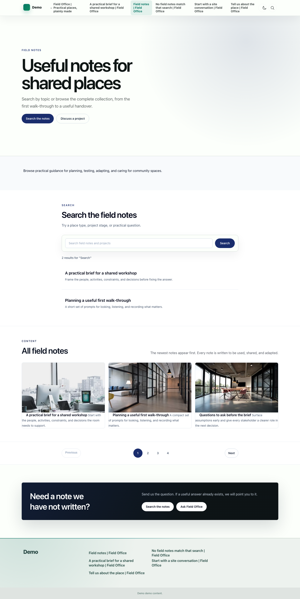
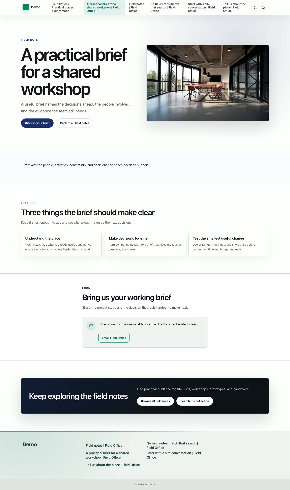

# Foundation Theme

<!-- prettier-ignore-start -->

## What This Plugin Adds

Foundation Theme is an **Available**, **No schema impact** Capell theme in the **Capell Themes** product group. It ships as `capell-app/theme-foundation` and extends these surfaces: admin, frontend.

Theme Foundation provides the shared public layouts, runtime design tokens, layout defaults, and override contracts used by Capell themes. It renders host-owned page data and does not introduce a separate content model.

Sites can use Foundation directly or extend it with a child theme, while public pages share predictable layout and token rendering without frontend authoring state.

Evidence: [`src/Providers/FoundationThemeServiceProvider.php`](src/Providers/FoundationThemeServiceProvider.php), [`src/Settings/FoundationThemeSettings.php`](src/Settings/FoundationThemeSettings.php), [`resources/views/app.blade.php`](resources/views/app.blade.php), [`resources/views/components/app/head/tokens.blade.php`](resources/views/components/app/head/tokens.blade.php), [`src/Support/Providers/RegistersLayoutNativeThemeDefaults.php`](src/Support/Providers/RegistersLayoutNativeThemeDefaults.php), [`tests/Feature/FleetPublicOutputSafetyTest.php`](tests/Feature/FleetPublicOutputSafetyTest.php), [`tests/Unit/ThemeRuntimeSettingsBindingTest.php`](tests/Unit/ThemeRuntimeSettingsBindingTest.php).

Status details:

- Status: Available
- Tier: free
- Bundle: themes
- Composer package: `capell-app/theme-foundation`
- Namespace: `Capell\FoundationTheme`
- Theme key: `default`

## Why It Matters

**For developers:** The package centralizes theme registration, token resolution, layout defaults, and public-output safety contracts for the theme fleet.

**For teams:** Teams get a consistent baseline for site chrome, layout behavior, and design settings across Capell themes.

Evidence: [`src/Providers/FoundationThemeServiceProvider.php`](src/Providers/FoundationThemeServiceProvider.php), [`src/Actions/ResolveFoundationThemeTokensAction.php`](src/Actions/ResolveFoundationThemeTokensAction.php), [`src/Actions/InstallFoundationThemeLayoutDefaultsAction.php`](src/Actions/InstallFoundationThemeLayoutDefaultsAction.php), [`src/Testing/AssertsPublicThemeOutputSafety.php`](src/Testing/AssertsPublicThemeOutputSafety.php), [`src/Settings/FoundationThemeSettings.php`](src/Settings/FoundationThemeSettings.php), [`resources/views/app.blade.php`](resources/views/app.blade.php), [`tests/Unit/FoundationThemeBoundaryTest.php`](tests/Unit/FoundationThemeBoundaryTest.php).

## Screens And Workflow

Screenshot contract: `docs/screenshots.json`.

Desktop, tablet, and mobile variants remain defined in the screenshot contract; this list groups them by workflow.

- Foundation Homepage (frontend, supplementary evidence).
- Foundation Directory (frontend, required evidence).
- Foundation Detail Article (frontend, required evidence).
- Foundation Contact (frontend, required evidence).
- Foundation Empty State (frontend, required evidence).
- Foundation Page Not Found (frontend, required evidence).
- Foundation Call To Action (frontend, required evidence).
- Foundation Chrome Homepage (frontend, required evidence).

## Technical Shape

### Service providers

- `Capell\FoundationTheme\Providers\FoundationThemeServiceProvider`
- `FoundationThemeSiteSpecServiceProvider`

### Config files

- `packages/theme-foundation/config/capell-theme-foundation.php`

### Settings migrations

- `packages/theme-foundation/database/settings/2026_05_10_190850_01_create_theme_foundation_settings.php`
- `packages/theme-foundation/database/settings/2026_05_23_160819_add_theme_foundation_design_tokens.php`
- `packages/theme-foundation/database/settings/2026_05_23_161002_refresh_theme_foundation_design_token_defaults.php`
- `packages/theme-foundation/database/settings/2026_05_23_170001_add_theme_foundation_composition_tokens.php`
- `packages/theme-foundation/database/settings/2026_05_23_171201_quiet_theme_foundation_composition_palette.php`
- `packages/theme-foundation/database/settings/2026_05_23_180101_add_theme_foundation_image_tokens.php`
- `packages/theme-foundation/database/settings/2026_06_07_000001_add_theme_foundation_dark_design_tokens.php`
- `packages/theme-foundation/database/settings/2026_06_07_000002_add_theme_foundation_typography_tokens.php`
- `packages/theme-foundation/database/settings/2026_07_05_000001_add_theme_foundation_motion_tokens.php`
- `packages/theme-foundation/database/settings/2026_07_14_210000_refresh_theme_foundation_capell_palette.php`
- `packages/theme-foundation/database/settings/2026_07_15_210000_add_theme_foundation_responsive_repeatable_layout.php`

### Settings classes

- `FoundationThemeSettings`
- `FoundationThemeSettingsMigrationProvider`

### Filament classes

- `AuthMenuWidget`
- `FoundationLayoutContainerSchemaExtender`
- `SectionVariantSchemaExtender`
- `FoundationThemeSettingsSchema`

### Livewire components

- `AbstractAssets`
- `PageAssets`
- `AbstractWidget`
- `Pages`

### Extension contracts

- `CompiledThemeReceiptSigningAuthority`
- `DesignSpecMigrationReader`
- `InstallsThemeDemo`
- `OptionalExtensionAvailability`
- `ProvidesThemeDemoContent`
- `ResultsListingResolver`

### Listeners

- `RunTailwindAssetsOnPackageChange`

### Actions

- `BuildAssetBannerItemsAction`
- `BuildBannerImageRenderDataAction`
- `BuildFooterLatestPageLinksAction`
- `BuildHeroRailItemsRenderDataAction`
- `BuildLayoutNeighborLinksDataAction`
- `BuildPageContentRenderDataAction`
- `BuildThemeDemoFormSectionAction`
- `BuildThemeDemoFormsPayloadAction`
- `BuildWidgetAssetRenderDataAction`
- `BuildCompiledThemeDistributionAction`
- `CanonicalizeDesignSpecAction`
- `CompileFoundationThemeArtifactAction`
- `ReadDesignSpecAction`
- `RenderFoundationDesignTokensAction`
- `ValidateCompiledThemeArtifactAction`
- `ValidateCompiledThemeDistributionAction`
- `ValidateDesignSpecAction`
- `GenerateThemeScaffoldAction`
- `HasThemeIntegrationEvidenceAction`
- `InstallFoundationThemeDemoAction`
- `InstallFoundationThemeLayoutDefaultsAction`
- `MarkPrimaryHeadingRenderedAction`
- `PrepareFoundationPageWidgetDataAction`
- `ResolveAuthMenuPayloadsAction`
- `ResolveFoundationSectionAnchorAction`
- `ResolveFoundationThemeTokensAction`
- `ResolveLoadedLayoutContainerBackgroundImageAction`
- `ResolveLoadedWidgetBackgroundImageAction`
- `ResolveNewsletterFormDataAction`
- `ResolveResultsArchiveUrlAction`
- `ResolveResultsListingAction`
- `ResolveSafeCssColorTokenAction`
- `ResolveThemeFormEmbedDataAction`
- `ResolveThemeFrontendScriptDataAction`
- `ResolveThemeOptionalSectionAvailabilityAction`
- `SetupFoundationThemePackageAction`
- `ValidateThemeCatalogueEntryAction`
- `WidgetIsSlotAction`

### Data objects

- `AssetBannerItemData`
- `AuthMenuInputData`
- `AuthMenuRenderData`
- `BannerImageRenderData`
- `CanonicalDesignSpecData`
- `CompiledThemeArtifactData`
- `CompiledThemeDistributionData`
- `CompiledThemeDistributionFileData`
- `CompiledThemeDistributionReceiptData`
- `CompiledThemeFileData`
- `DesignSpecAccessibilityData`
- `DesignSpecAssetData`
- `DesignSpecBrandData`
- `DesignSpecColorModeData`
- `DesignSpecComponentsData`
- `DesignSpecData`
- `DesignSpecDisplayData`
- `DesignSpecLayoutData`
- `DesignSpecLocaleData`
- `DesignSpecLocaleTypographyData`
- `DesignSpecPaletteData`
- `DesignSpecSiteData`
- `DesignSpecTypographyData`
- `DesignSpecTypographyRoleData`
- `FooterLatestPageLinkData`
- `FoundationLayoutContainerPresentationData`
- `FoundationPreparedPageData`
- `FoundationThemeTokensData`
- `LayoutNeighborLinksData`
- `NewsletterFormData`
- `PageContentRenderData`
- `ResultsListingData`
- `ThemeDemoInstallData`
- `ThemeFormEmbedData`
- `ThemeFrontendScriptData`
- `ThemeScaffoldRequestData`
- `ThemeValidationResultData`
- `WidgetAssetRenderData`

### Command signatures

- `capell:theme-foundation-demo`
- `capell:theme-foundation-setup`

### Manifest action API

- `demo: Capell\FoundationTheme\Actions\InstallFoundationThemeDemoAction`
- `setup: Capell\FoundationTheme\Actions\SetupFoundationThemePackageAction`

### Console command classes

- `DemoCommand`
- `GenerateTailwindAssetsCommand`
- `MakeThemeCommand`
- `SetupCommand`
- `ThemeCatalogueReportCommand`
- `ValidateThemesCommand`

### Health checks

- `Capell\FoundationTheme\Health\FoundationThemeHealthCheck`

### Blade views

- `packages/theme-foundation/resources/views/app.blade.php`
- `packages/theme-foundation/resources/views/block/wrapper.blade.php`
- `packages/theme-foundation/resources/views/components/actions/index.blade.php`
- `packages/theme-foundation/resources/views/components/app/body.blade.php`
- `packages/theme-foundation/resources/views/components/app/head/custom.blade.php`
- `packages/theme-foundation/resources/views/components/app/head/tokens.blade.php`
- `packages/theme-foundation/resources/views/components/badge.blade.php`
- `packages/theme-foundation/resources/views/components/block/wrapper.blade.php`
- `packages/theme-foundation/resources/views/components/button/index.blade.php`
- `packages/theme-foundation/resources/views/components/content.blade.php`
- `packages/theme-foundation/resources/views/components/demo/contact-page.blade.php`
- `packages/theme-foundation/resources/views/components/display/art-directed-picture.blade.php`
- `packages/theme-foundation/resources/views/components/display/byline-with-metadata.blade.php`
- `packages/theme-foundation/resources/views/components/display/card-frame-wrapper.blade.php`
- `packages/theme-foundation/resources/views/components/display/count-up-stat.blade.php`
- `packages/theme-foundation/resources/views/components/display/hover-video-poster.blade.php`
- `packages/theme-foundation/resources/views/components/display/map-link.blade.php`
- `packages/theme-foundation/resources/views/components/display/photo-treatment-filter.blade.php`
- `packages/theme-foundation/resources/views/components/display/responsive-table-to-cards.blade.php`
- `packages/theme-foundation/resources/views/components/display/timestamp-metadata-block.blade.php`
- `packages/theme-foundation/resources/views/components/dropdown/index.blade.php`
- `packages/theme-foundation/resources/views/components/dropdown/link.blade.php`
- `packages/theme-foundation/resources/views/components/footer/index.blade.php`
- `packages/theme-foundation/resources/views/components/footer/latest-pages.blade.php`
- `packages/theme-foundation/resources/views/components/footer/menu.blade.php`
- `packages/theme-foundation/resources/views/components/footer/related-sites.blade.php`
- `packages/theme-foundation/resources/views/components/footer/site-info.blade.php`
- `packages/theme-foundation/resources/views/components/footer/social-links.blade.php`
- `packages/theme-foundation/resources/views/components/footer/sub-footer.blade.php`
- `packages/theme-foundation/resources/views/components/header/index.blade.php`
- `packages/theme-foundation/resources/views/components/header/menu/dropdown.blade.php`
- `packages/theme-foundation/resources/views/components/header/menu/item.blade.php`
- `packages/theme-foundation/resources/views/components/header/menu/languages-dropdown.blade.php`
- `packages/theme-foundation/resources/views/components/heading/index.blade.php`
- `packages/theme-foundation/resources/views/components/heading/subheading.blade.php`
- `packages/theme-foundation/resources/views/components/icon/index.blade.php`
- `packages/theme-foundation/resources/views/components/icon/spinner.blade.php`
- `packages/theme-foundation/resources/views/components/languages.blade.php`
- `packages/theme-foundation/resources/views/components/layout/area.blade.php`
- `packages/theme-foundation/resources/views/components/layout/container.blade.php`
- `packages/theme-foundation/resources/views/components/layout/index.blade.php`
- `packages/theme-foundation/resources/views/components/layout/main.blade.php`
- `packages/theme-foundation/resources/views/components/layout/widget.blade.php`
- `packages/theme-foundation/resources/views/components/lightbox.blade.php`
- `packages/theme-foundation/resources/views/components/list/index.blade.php`
- `packages/theme-foundation/resources/views/components/list/item.blade.php`
- `packages/theme-foundation/resources/views/components/list/list-item.blade.php`
- `packages/theme-foundation/resources/views/components/logo/index.blade.php`
- `packages/theme-foundation/resources/views/components/logo/title.blade.php`
- `packages/theme-foundation/resources/views/components/media/background.blade.php`
- `packages/theme-foundation/resources/views/components/media/svg.blade.php`
- `packages/theme-foundation/resources/views/components/no-results.blade.php`
- `packages/theme-foundation/resources/views/components/pagination/hero-summary.blade.php`
- `packages/theme-foundation/resources/views/components/section/repeatable-carousel.blade.php`
- `packages/theme-foundation/resources/views/components/section/team-member.blade.php`
- `packages/theme-foundation/resources/views/components/section/widget.blade.php`
- `packages/theme-foundation/resources/views/components/structured-data.blade.php`
- `packages/theme-foundation/resources/views/components/theme/page-shell.blade.php`
- `packages/theme-foundation/resources/views/components/widget/announcement-bar.blade.php`
- `packages/theme-foundation/resources/views/components/widget/asset/accordion.blade.php`
- `packages/theme-foundation/resources/views/components/widget/asset/banners.blade.php`
- `packages/theme-foundation/resources/views/components/widget/asset/carousel.blade.php`
- `packages/theme-foundation/resources/views/components/widget/asset/extended-background.blade.php`
- `packages/theme-foundation/resources/views/components/widget/asset/feature-item.blade.php`
- `packages/theme-foundation/resources/views/components/widget/asset/features.blade.php`
- `packages/theme-foundation/resources/views/components/widget/asset/index.blade.php`
- `packages/theme-foundation/resources/views/components/widget/asset/media.blade.php`
- `packages/theme-foundation/resources/views/components/widget/asset/pages.blade.php`
- `packages/theme-foundation/resources/views/components/widget/asset/testimonials.blade.php`
- `packages/theme-foundation/resources/views/components/widget/asset/widgets.blade.php`
- `packages/theme-foundation/resources/views/components/widget/banner-image.blade.php`
- `packages/theme-foundation/resources/views/components/widget/default.blade.php`
- `packages/theme-foundation/resources/views/components/widget/foundation-section.blade.php`
- `packages/theme-foundation/resources/views/components/widget/hero.blade.php`
- `packages/theme-foundation/resources/views/components/widget/kitchen-sink/reference.blade.php`
- `packages/theme-foundation/resources/views/components/widget/modern/alternating-content.blade.php`
- `packages/theme-foundation/resources/views/components/widget/modern/card-grid.blade.php`
- `packages/theme-foundation/resources/views/components/widget/modern/cta-section.blade.php`
- `packages/theme-foundation/resources/views/components/widget/modern/faq-section.blade.php`
- `packages/theme-foundation/resources/views/components/widget/modern/feature-list.blade.php`
- `packages/theme-foundation/resources/views/components/widget/modern/hero-banner.blade.php`
- `packages/theme-foundation/resources/views/components/widget/modern/image-gallery.blade.php`
- `packages/theme-foundation/resources/views/components/widget/modern/pricing-table.blade.php`
- `packages/theme-foundation/resources/views/components/widget/modern/process-steps.blade.php`
- `packages/theme-foundation/resources/views/components/widget/modern/stats-section.blade.php`
- `packages/theme-foundation/resources/views/components/widget/modern/team-members.blade.php`
- `packages/theme-foundation/resources/views/components/widget/modern/testimonials.blade.php`
- `packages/theme-foundation/resources/views/components/widget/navigation/index.blade.php`
- `packages/theme-foundation/resources/views/components/widget/navigation/tabs.blade.php`
- `packages/theme-foundation/resources/views/components/widget/page/breadcrumbs.blade.php`
- `packages/theme-foundation/resources/views/components/widget/page/content.blade.php`
- `packages/theme-foundation/resources/views/components/widget/slot.blade.php`
- `packages/theme-foundation/resources/views/components/widget/snippet.blade.php`
- `packages/theme-foundation/resources/views/components/widget/wrapper.blade.php`
- `packages/theme-foundation/resources/views/forms/embed.blade.php`
- `packages/theme-foundation/resources/views/forms/newsletter.blade.php`
- `packages/theme-foundation/resources/views/theme/chrome/footer.blade.php`
- `packages/theme-foundation/resources/views/theme/chrome/navigation.blade.php`
- `packages/theme-foundation/resources/views/theme/page.blade.php`
- `packages/theme-foundation/resources/views/theme/partials/mobile-navigation.blade.php`
- `packages/theme-foundation/resources/views/theme/sections/changelog-stream--grid.blade.php`
- `packages/theme-foundation/resources/views/theme/sections/changelog-stream.blade.php`
- `packages/theme-foundation/resources/views/theme/sections/contact-split.blade.php`
- `packages/theme-foundation/resources/views/theme/sections/content-listing--grid.blade.php`
- `packages/theme-foundation/resources/views/theme/sections/content-listing--masonry-safe.blade.php`
- `packages/theme-foundation/resources/views/theme/sections/content-listing--rows.blade.php`
- `packages/theme-foundation/resources/views/theme/sections/content-listing.blade.php`
- `packages/theme-foundation/resources/views/theme/sections/cta--band.blade.php`
- `packages/theme-foundation/resources/views/theme/sections/cta--card.blade.php`
- `packages/theme-foundation/resources/views/theme/sections/cta--inline.blade.php`
- `packages/theme-foundation/resources/views/theme/sections/cta.blade.php`
- `packages/theme-foundation/resources/views/theme/sections/faq-search-discovery--categorised.blade.php`
- `packages/theme-foundation/resources/views/theme/sections/faq-search-discovery.blade.php`
- `packages/theme-foundation/resources/views/theme/sections/features.blade.php`
- `packages/theme-foundation/resources/views/theme/sections/footer.blade.php`
- `packages/theme-foundation/resources/views/theme/sections/form--encouraging.blade.php`
- `packages/theme-foundation/resources/views/theme/sections/form.blade.php`
- `packages/theme-foundation/resources/views/theme/sections/hero--full-bleed.blade.php`
- `packages/theme-foundation/resources/views/theme/sections/hero--split.blade.php`
- `packages/theme-foundation/resources/views/theme/sections/hero--stacked.blade.php`
- `packages/theme-foundation/resources/views/theme/sections/hero.blade.php`
- `packages/theme-foundation/resources/views/theme/sections/navigation.blade.php`
- `packages/theme-foundation/resources/views/theme/sections/pagination.blade.php`
- `packages/theme-foundation/resources/views/theme/sections/partials/contact-split-form-body.blade.php`
- `packages/theme-foundation/resources/views/theme/sections/partials/form-body.blade.php`
- `packages/theme-foundation/resources/views/theme/sections/partials/form-encouraging-body.blade.php`
- `packages/theme-foundation/resources/views/theme/sections/pricing-value-spectrum--compact.blade.php`
- `packages/theme-foundation/resources/views/theme/sections/pricing-value-spectrum.blade.php`
- `packages/theme-foundation/resources/views/theme/sections/proof.blade.php`
- `packages/theme-foundation/resources/views/theme/sections/search.blade.php`
- `packages/theme-foundation/resources/views/theme/sections/stats-display-band--light.blade.php`
- `packages/theme-foundation/resources/views/theme/sections/stats-display-band.blade.php`
- `packages/theme-foundation/resources/views/widget/kitchen-sink/reference.blade.php`
- `packages/theme-foundation/resources/views/widgets/auth-menu.blade.php`

### Cache tags

- `theme-foundation`

## Child Theme Override Contract

Foundation Theme owns the stable child theme override surface for Capell themes. Child themes should declare `extends: 'default'` and override documented sections, views, tokens, and chrome areas instead of replacing the whole public rendering path.

Stable contract points:

- Theme Studio sections: `navigation`, `hero`, `features`, `proof`, `content-listing`, `search`, `pagination`, `form`, `contact-split`, `cta`, `footer`.
- Shared views: `capell::theme.page`, `capell::layout.area`, `capell::media.svg`.
- Runtime tokens: `--foundation-page-bg`, `--foundation-section-spacing`, `--foundation-widget-gap`.
- Layout Builder chrome areas: `header`.
- Public-output rule: child themes must not expose authoring metadata, editor controls, model IDs, field paths, permissions, or signed editor URLs.

## Data Model

This theme has no schema impact. It relies on core Capell site, page, locale, and theme records instead of declaring package-owned tables.

## Install Impact

- Required packages: `capell-app/core`, `capell-app/frontend`, `capell-app/layout-builder`, `capell-app/navigation`.
- Admin navigation: no admin page or resource contribution is declared.
- Admin/editor extensions: none declared.
- Permissions: no package permission declarations or Shield gates detected; host access rules still apply.
- Public routes: none declared.
- Database changes: no package migrations declared.
- Config: `config/capell-theme-foundation.php`.
- Settings: `Capell\FoundationTheme\Settings\FoundationThemeSettings`.
- Queues or schedules: none declared.
- Cache tags: `theme-foundation`.
- Commands: `capell:theme-foundation-demo`, `capell:theme-foundation-setup`.

## Common Pitfalls

- Keep required Capell packages on compatible v4 releases: `capell-app/core`, `capell-app/frontend`, `capell-app/layout-builder`, `capell-app/navigation`.
- Review package configuration before production-like verification: `config/capell-theme-foundation.php`, `Capell\FoundationTheme\Settings\FoundationThemeSettings`.
- Keep public Blade and cached HTML free of authoring markers, model IDs, permissions, signed editor URLs, and lazy database queries.
- Custom write integrations must preserve invalidation for `theme-foundation` cache tags.

## Troubleshooting

| Symptom | Likely cause | Check | Fix |
| --- | --- | --- | --- |
| Package surface is missing after install | Provider or manifest is not loaded | Confirm `capell.json`, package `composer.json`, and provider registration | Reinstall the package, refresh Composer autoload, and clear host caches |
| Public output leaks unexpected state | Render data, cache variation, or authoring boundary has regressed | Check public Blade, cache tags, and public-output safety tests | Move data loading out of Blade and rerun the package public-output tests |

## Quick Start

1. Install the package: `composer require capell-app/theme-foundation`.
2. Run the package setup: `php artisan capell:theme-foundation-setup`.
3. See it working: run `php artisan capell:theme-foundation-demo`.
4. Open `/theme-default-directory` and confirm the public output renders without admin state.

## Next Steps

- [Package docs](docs/README.md)
- [Overview](docs/overview.md)
- [Worked extension examples](docs/extension-contracts.md)
- Configuration files: [`config/capell-theme-foundation.php`](config/capell-theme-foundation.php).
- [Troubleshooting](#troubleshooting)
- [Screenshot contract](docs/screenshots.json)
- [Marketplace assets](docs/assets/marketplace/)
- [Capell content language plan](../../docs/CONTENT_LANGUAGE_PLAN.md)
- [Capell documentation design system](../../docs/DESIGN_SYSTEM.md)
- [Capell and package ERD notes](../../docs/erd/capell-and-package-erds.md)
- Related packages: [Layout Builder](../layout-builder/README.md), [Navigation](../navigation/README.md).
- Focused tests: `vendor/bin/pest packages/theme-foundation/tests --configuration=phpunit.xml`.

<!-- prettier-ignore-end -->
