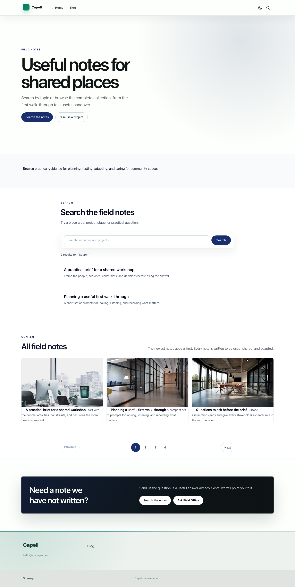
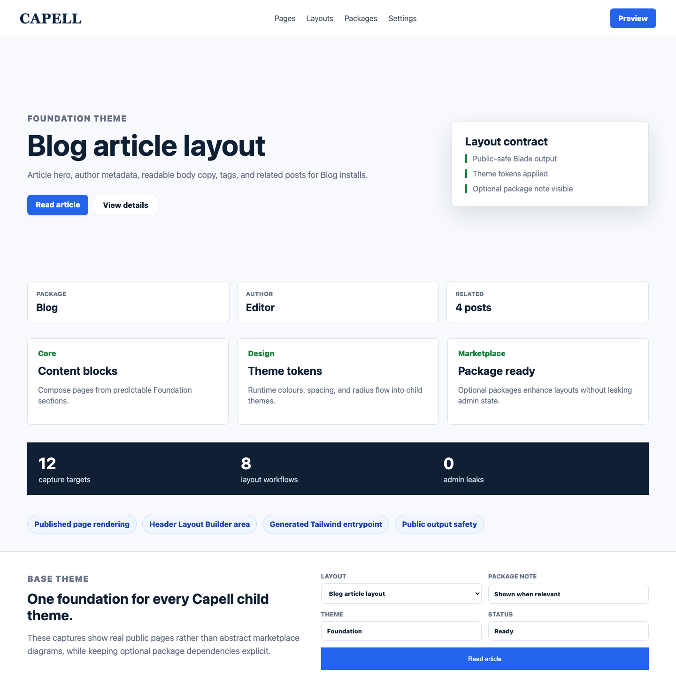
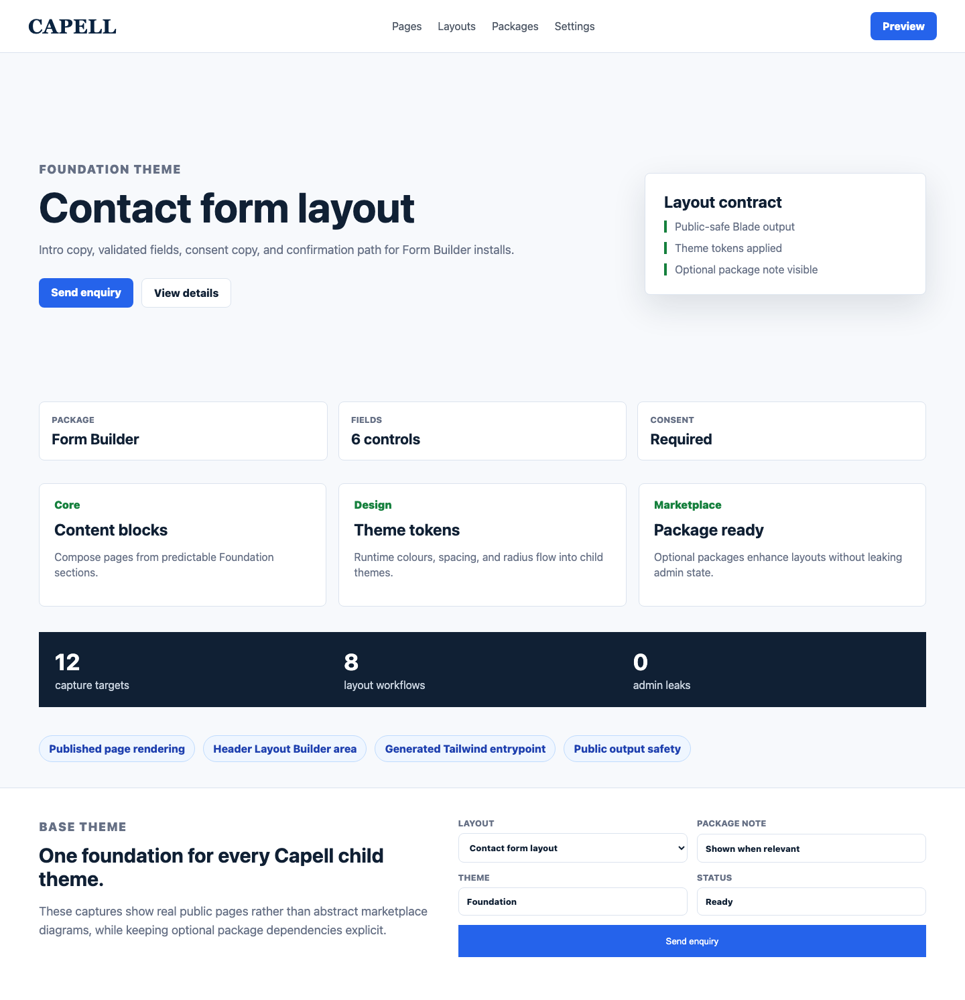
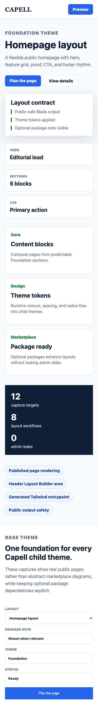

# Foundation Theme

<!-- prettier-ignore-start -->

Foundation is the free base theme: the Blade layouts, runtime design tokens, Tailwind asset pipeline, Blade directives, and media/SVG handling that every vertical Capell theme extends. Its themeKey is `default` and it extends nothing — everything else sits on top of it.

Read this two ways. If you are choosing a free theme, Foundation is a plain, high-contrast navy-on-white design that works as a finished site. If you are building a child theme, Foundation is the contract you inherit.

## Child Theme Override Contract


## Put it on your site

```bash
composer require capell-app/theme-foundation
```

Then, in the admin:

1. Open **System → Themes**. Foundation appears as an installed package definition.
2. Choose **Create theme** to turn that definition into a theme record you can edit.
3. Choose **Preview**, pick the site, page, and preset you want to see, and open it in a new tab. Nothing on the live site has changed yet.
4. When you are happy, choose **Apply theme**. Set **Activation scope** to **Global** to change the default theme for every site without its own override, or to **Selected sites** to change only the sites you name.

Applying a theme refreshes the frontend cache keys for the sites it affects, so the change shows immediately.

### Start from the demo content

To get the pages below rather than an empty site:

```bash
php artisan capell:theme-foundation-demo
```

Foundation's demo command declares no parameters — run it as-is.

## The pages you get

Every page shares the same skeleton: sticky white header, editorial eyebrow and heading, a floating **Layout contract** card, three stat cards, three labelled feature cards (Core / Design / Marketplace), a dark navy figures strip, and a closing "One foundation for every Capell child theme" panel. That repetition is deliberate — it is the rhythm child themes redecorate.

### Homepage

Hero, feature grid, proof, CTA, footer. The stat cards read HERO / SECTIONS / CTA, and the blue pills below the navy strip name the runtime surfaces: published page rendering, header Layout Builder area, generated Tailwind entrypoint, public output safety.

### Listing page

Card grid, filters, pagination, and the empty-state language for browseable content sets. The stat cards switch to CARDS · 12 shown, FILTERS · 3 active, PAGE · 1 of 4.



### Detail article

Article hero, author metadata, readable body copy, tags, and related posts. Stat cards name the package supplying the content, the author, and the related-post count.



### Contact form

Intro copy, validated fields, consent copy, and a confirmation path. The panel at the foot of the page shows the form controls Foundation styles — labelled selects, text inputs, and a full-width blue submit button.



Empty-state, not-found, and CTA captures also ship in `docs/screenshots/`, at desktop, tablet, and phone widths.

## On a phone

The header drops to the wordmark and the Preview button. Everything else stacks into one column, including the navy figures strip, which goes from three columns to three stacked rows.



## Extending Foundation

Child themes declare `extends: 'default'` and override documented surfaces rather than replacing the public rendering path:

- Theme Studio sections: `navigation`, `hero`, `features`, `proof`, `content-listing`, `search`, `pagination`, `form`, `contact-split`, `cta`, `footer`.
- Shared views: `capell::theme.page`, `capell::layout.area`, `capell::media.svg`.
- Runtime tokens: `--foundation-page-bg`, `--foundation-section-spacing`, `--foundation-widget-gap`.
- Layout Builder chrome areas: `header`.

Public output must not expose authoring metadata, editor controls, model IDs, field paths, permissions, or signed editor URLs.

## Before you install

Foundation extends nothing — it is the base. It needs these packages present:

- `capell-app/core`
- `capell-app/frontend`
- `capell-app/layout-builder`

Composer pulls them in for you. Foundation declares no optional pairings and no conflicts.

Colours, fonts, and spacing are Theme Studio tokens, so you can change them under **Customize** without editing a Blade file.

---

For the package boundary, runtime surfaces, and troubleshooting, see the [package README](../README.md).

<!-- prettier-ignore-end -->
